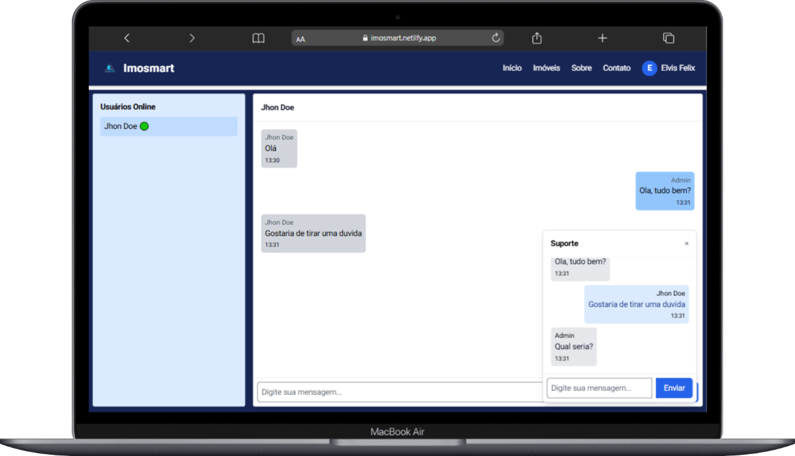
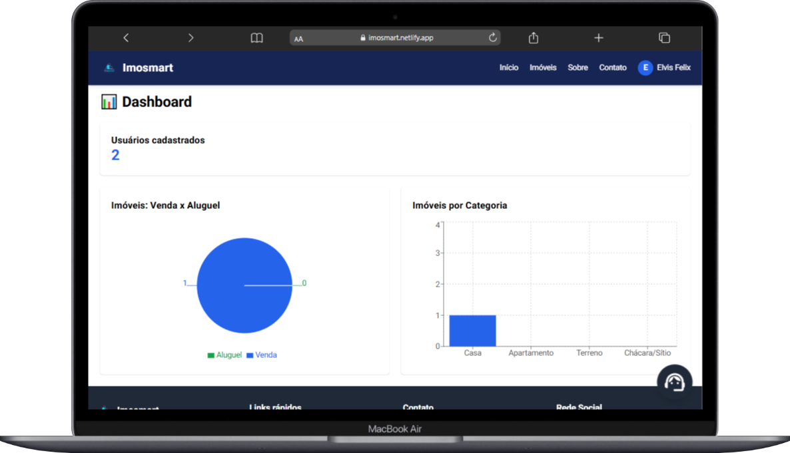
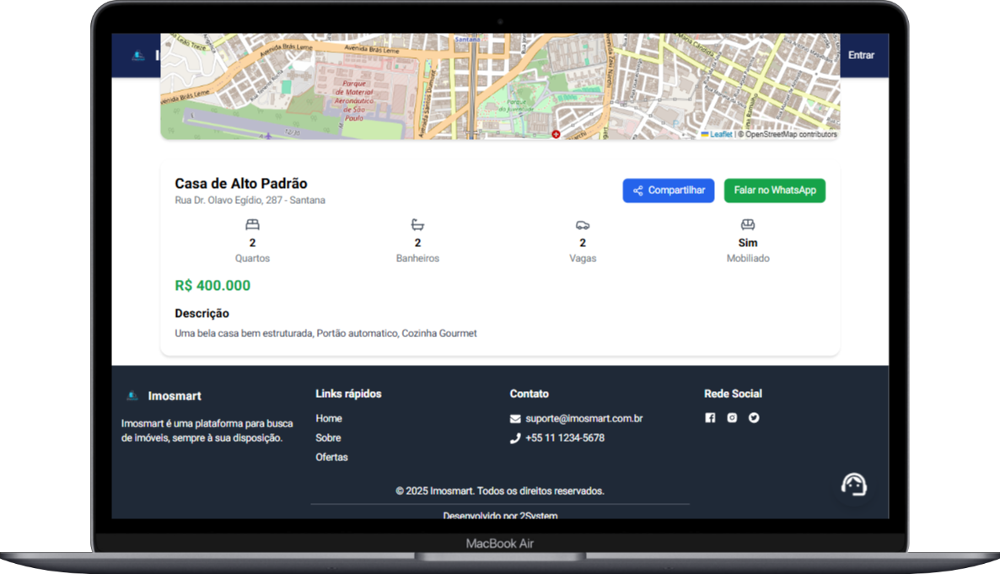
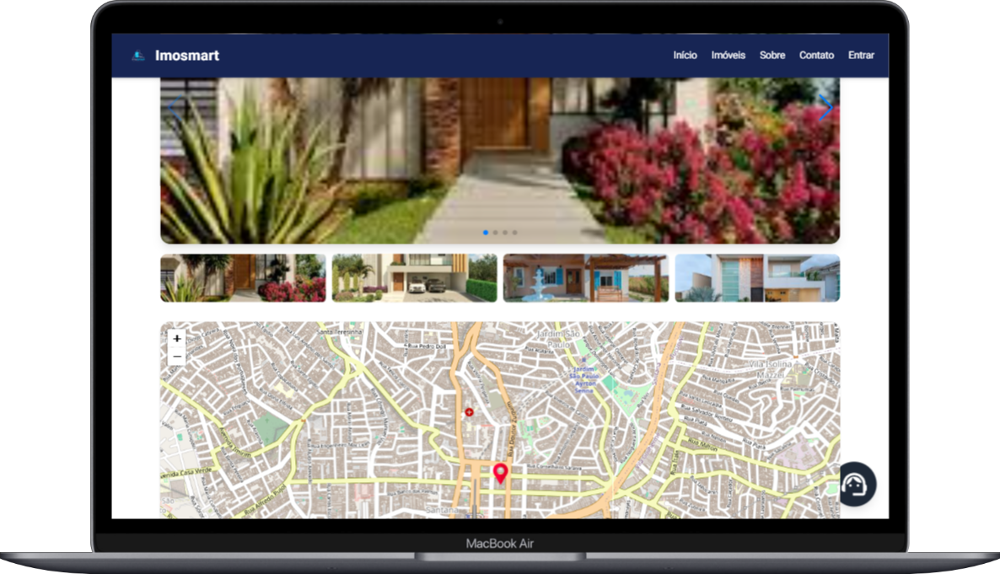

# 🏡 Imosmart

O **Imosmart** é uma aplicação web para gestão e visualização de imóveis, semelhante a plataformas de aluguel e venda como OLX Imóveis.  
A plataforma permite o cadastro de imóveis, gerenciamento de usuários e exibição de informações detalhadas, com fotos armazenadas em nuvem.

**Imosmart** is a web application for property management and visualization, similar to rental and sales platforms like OLX Imóveis.  
The platform allows property listing, user management, and displaying detailed information with photos stored in the cloud.

---

## 🚀 Tecnologias Utilizadas | Technologies Used

### Frontend
- [ReactJS](https://reactjs.org/) com [Vite](https://vitejs.dev/) | with Vite
- [Tailwind CSS](https://tailwindcss.com/) para estilização | for styling
- [React Router](https://reactrouter.com/) para navegação | for navigation
- [Axios](https://axios-http.com/) para comunicação com a API | for API communication

### Backend
- [Node.js](https://nodejs.org/)
- [Express](https://expressjs.com/)
- [MongoDB](https://www.mongodb.com/) + [Mongoose](https://mongoosejs.com/)
- [JWT](https://jwt.io/) para autenticação | for authentication
- [Multer](https://github.com/expressjs/multer) para upload | for file upload
- [Cloudinary](https://cloudinary.com/) ou [AWS S3](https://aws.amazon.com/s3/) para armazenamento de imagens | for image storage

---

## 📂 Estrutura do Projeto | Project Structure

```
/imosmart
  ├── backend
  │   ├── models
  │   ├── routes
  │   ├── controllers
  │   └── server.js
  ├── frontend
  │   ├── src
  │   │   ├── components
  │   │   ├── pages
  │   │   └── App.jsx
  └── README.md
```

---

## ⚙️ Funcionalidades (MVP) | Features (MVP)

- Cadastro de usuários (login e registro) | User registration and login
- Autenticação com JWT | JWT authentication
- Cadastro de imóveis com: | Property listing with:
  - Título | Title
  - Descrição | Description
  - Localização | Location
  - Fotos | Photos
  - Preço | Price
  - Tipo (aluguel ou venda) | Type (rent or sale)
  - Exibição de imóveis na página inicial | Display properties on homepage
  - Página de detalhes do imóvel | Property detail page
  - Upload de imagens para nuvem | Cloud image upload
  - Chat entre proprietário e interessado | Chat between owner and buyer/renter
  - Dashboard para gerenciar imóveis | Dashboard for property management
  - Integração com Google Maps | Google Maps integration
  - Filtro de imóveis por localização e tipo | Property filtering by location and type

---

## 📌 Futuras Features (v2.0) | Future Features (v2.0)

- Sistema de favoritos | Favorites system
- Avaliação de imóveis | Property reviews

---

## ▶️ Como Rodar o Projeto | How to Run the Project

### 1. Clonar o repositório | Clone the repository
```bash
git clone https://github.com/ElvisFelix-dev/imosmart.git
```

### 2. Backend
```bash
cd backend
npm install
npm run dev
```

### 3. Frontend
```bash
cd frontend
npm install
npm run dev
```

---

## 🔑 Variáveis de Ambiente | Environment Variables

Crie um arquivo **.env** no backend com as variáveis:  
Create a **.env** file in the backend with the following variables:

```
PORT=5000
MONGODB_URI = 
MONGODB_URI_ATLAS = 
PAYPAL_CLIENT_ID = 

JWT_SECRET = 

CLOUDINARY_CLOUD_NAME=
CLOUDINARY_API_KEY=
CLOUDINARY_API_SECRET=

GOOGLE_MAPS_API_KEY = 
EMAIL_USER=
EMAIL_PASS=

CLIENT_URL=
PORT=3333
CORS_ORIGINS=

MAILGUN_DOMIAN = 
MAILGUN_API_KEY = 
```

---

## 🌐 Deploy

### Backend (Render)
- 🇧🇷 Acesse [Render](https://render.com/), crie um novo serviço Web, conecte ao repositório e configure as variáveis de ambiente. Deploy automático.  
- 🇺🇸 Go to [Render](https://render.com/), create a new Web Service, connect it to your repository, and set up environment variables. Automatic deployment.

### Frontend (Vercel ou Netlify)
- **Vercel**
  - 🇧🇷 Acesse [Vercel](https://vercel.com/), importe o repositório do frontend, configure variáveis se necessário e o deploy será automático.  
  - 🇺🇸 Go to [Vercel](https://vercel.com/), import the frontend repository, configure environment variables if necessary, and deployment runs automatically.

- **Netlify**
  - 🇧🇷 Acesse [Netlify](https://www.netlify.com/), conecte ao repositório do frontend, configure comando `npm run build` e diretório `dist`. Deploy automático.  
  - 🇺🇸 Go to [Netlify](https://www.netlify.com/), connect the frontend repository, set build command `npm run build` and output directory `dist`. Automatic deployment.

---

## 📸 Preview







  <p align="center">
    <br />
    <a href="https://imosmart.netlify.app" target="_blank" rel="noreferrer">Imosmart</a>
  </p>


## 👨‍💻 Autor | Author

- 🇧🇷 Desenvolvido por **Elvis Felix** 🚀  
- 🇺🇸 Developed by **Elvis Felix** 🚀
 <a href="https://linkedin.com/in/https://www.linkedin.com/in/elvis-felix" target="blank"></a> <br/>

 ## :memo: Licença 

Distribuído sob a licença **MIT**. Veja `LICENSE` para mais informações.
